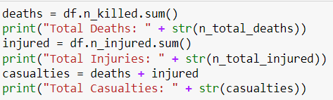

# Data Science Gun Violence Report
## Introduction 

The purpose of this project is to look at recent gun violence crimes in the United States. To look at if there are any correlations between these acts of violence such as being more frequent in certain cities or any other strange occurrences in the data. 

## Selection of Data 

The data group I selected for this project is: 
https://www.kaggle.com/datasets/jasonmobley/united-states-gun-violence-data-20142022 

This data is gun violence from January 1st , 2014 up until June 15th, 2022. It includes any violent gun crimes within this time span. So even if it was an accident it is counted within the dataset. It also includes data from these crimes even if no one was killed, it counts injuries and deaths in separate categories. It also provides the location of the incident as well as the date it occurred, along with the incident number to validate that these crimes really did occur. 

Example of the data

## Methods

- NumPy, Pandas, and matplot for data analysis and inference
- GitHub for the writing portion
- Kaggle for the dataset
- Jupyter for compiling and running the data
Examples from Jupyter

## Results

In these screenshots it shows off what the data represents

Total Casualties due to Gun Violence:

Deaths Due to Gun Violence by state:

Injuries Due to Gun Violence by state:

How Gun Violecne has developed over the years.
The line seperates the injurieds from the deaths, Injuries on the left and deaths on the right

## Discussion

Experimenting with the data exposed many strange things such as where most deaths are and some other interesting facts. Such as Wyoming and Vermont sharing being the states with the lowest deaths and injuries rate among all states. Another finding is how California and Texas are nearing the top both charts for highest injuries and 
deaths however Illinois takes the top spot of most injured by a whopping 12,000 more injured by gun violence then the second top states being California.

Now with this information I could do research into why these statistics might be such as population density or other crime rates, and I foudn some interesting information. Such as with Illinois, which has the city of Chicago in it which is know for gang activity and petty crimes which could contribute to why it has such a high injury count. Another facinating thing found is for Wyoming and Vernmont, the population densitys are so low which is why gun violence is rarer, its hard to have gun crimes when no one lives close to each other.

On large fact that is revealed which answers the main questions is that over the years since 2014 gun violence has been on a noticble rise not only in injuries but in deaths aswell. It answers the wuestions I had in the beginning of this project, but it is unknown as to why the crime has risen over the years. Could it be more criminals? More unwell people? or maybe its as simple as more people in the world.

## Summary

In this project I wanted to see if crime has risen over the years and where the most dangerous places in the United States are. I was able to find the answers to my questions, Gun Violence has been on the rise since 2014 not in a stagnnt pattern but an increase. The most dangerous places are Illinois, California and Texas. The safest places are Wyoming, Vernmont and Hawaii.

