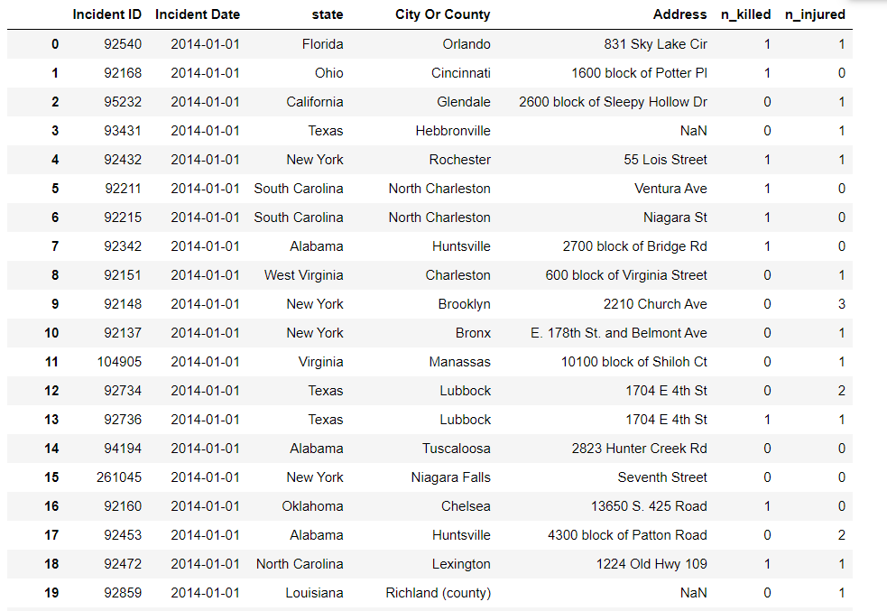
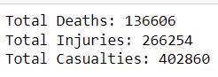
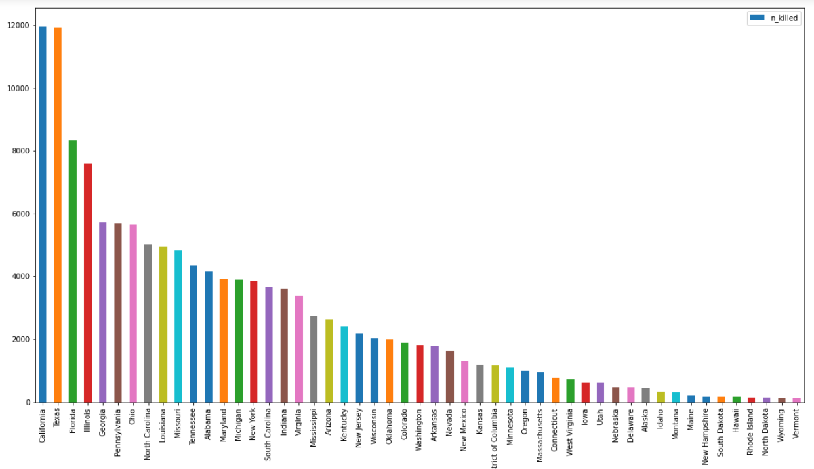
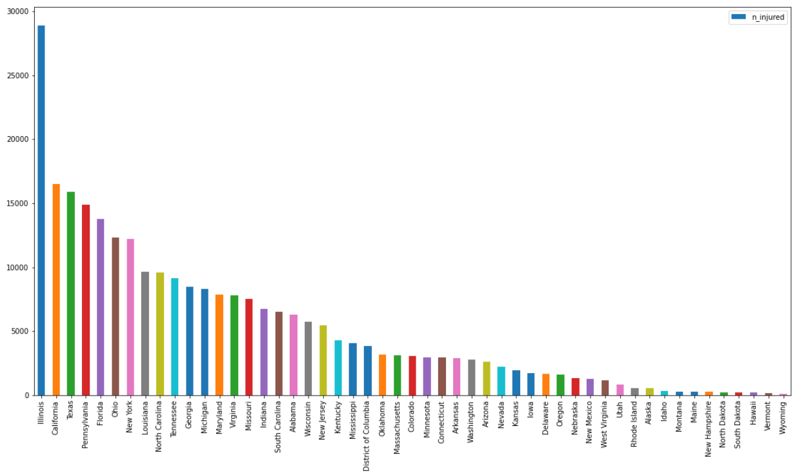
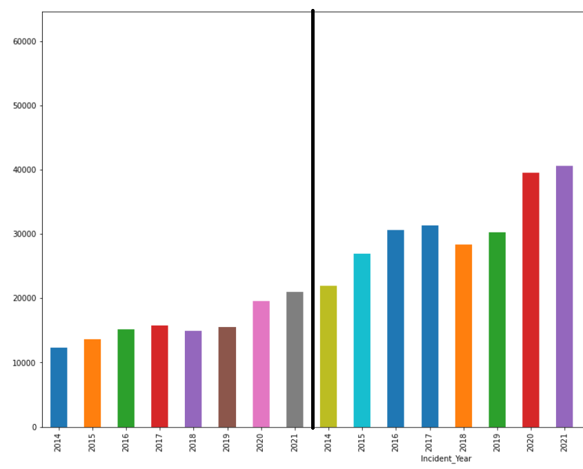

# Data Science Gun Violence Report
## Introduction 

The purpose of this project is to look at recent gun violence crimes in the United States. To look at if there are any correlations between these acts of violence such as being more frequent in certain cities or any other strange occurrences in the data. 

## Selection of Data 

The data group I selected for this project is: 
https://www.kaggle.com/datasets/jasonmobley/united-states-gun-violence-data-20142022 

This data is gun violence from January 1st , 2014 up until June 15th, 2022. It includes any violent gun crimes within this time span. So even if it was an accident it is counted within the dataset. It also includes data from these crimes even if no one was killed, it counts injuries and deaths in separate categories. It also provides the location of the incident as well as the date it occurred, along with the incident number to validate that these crimes really did occur. 

Example of the data

## Methods

- NumPy, Pandas, and matplot for data analysis and inference
- GitHub for the writing portion
- Kaggle for the dataset
- Jupyter for compiling and running the data

## Results

In these screenshots it shows off what the data represents

Total Casualties due to Gun Violence:

Deaths Due to Gun Violence by state:

Injuries Due to Gun Violence by state:

How Gun Violecne has developed over the years.
The line seperates the injurieds from the deaths, Injuries on the left and deaths on the right

## Discussion

Experimenting with the data exposed many strange things such as where most deaths are and some other interesting facts. Such as Wyoming and Vermont sharing being the states with the lowest deaths and injuries rate among all states. Another finding is how California and Texas are nearing the top both charts for highest injuries and 
deaths however Illinois takes the top spot of most injured by a whopping 12,000 more injured by gun violence then the second top states being California.
